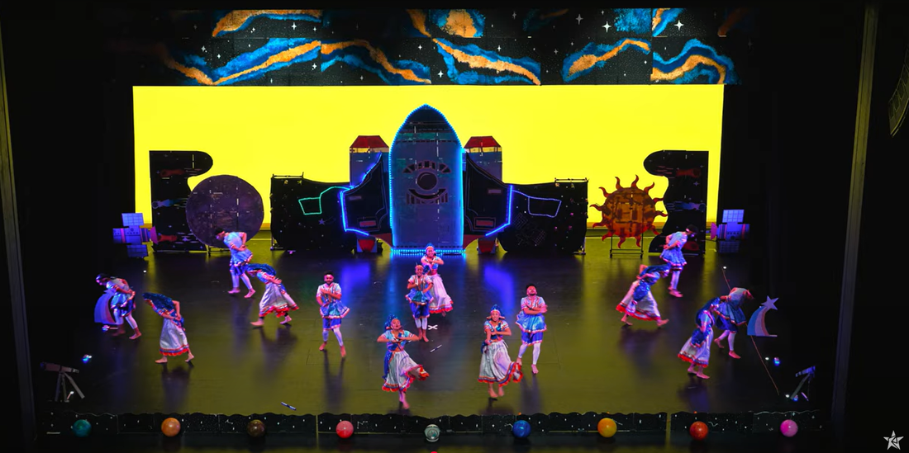
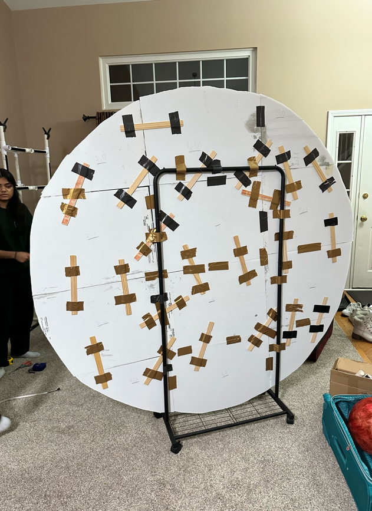
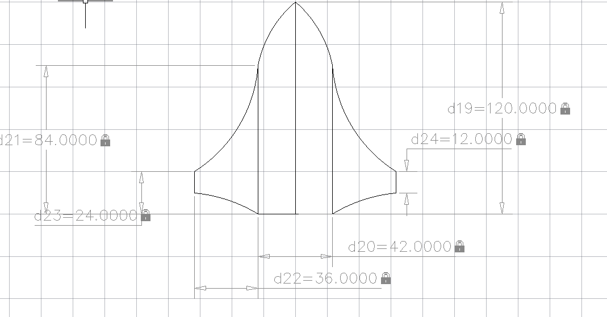
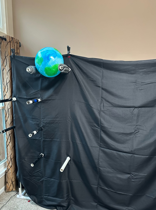
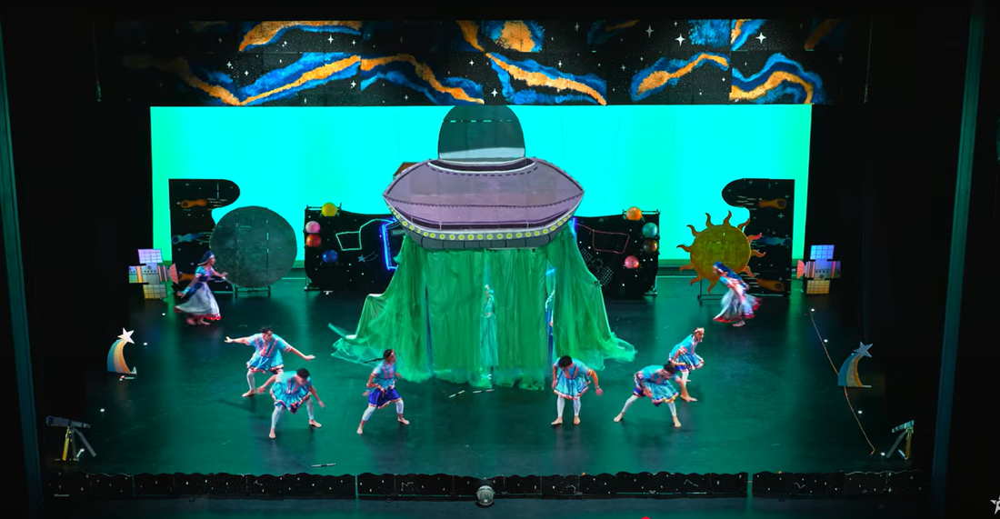
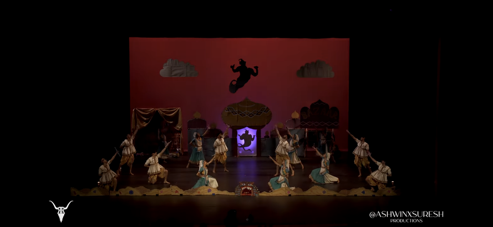

# Dance Experience – Illini Raas

I was the captain of Illini Raas, a competitive cultural dance team at the University of Illinois. We performed across the country at events like **Raas All-Stars** at the Harris Theater in Chicago. My role combined choreography, stage design, and logistics — with a strong engineering mindset behind the scenes.

---

## 🪩 Team and Theme

Each season we created a full 7-minute performance combining choreography, storytelling, and large-scale **stage props**. For our “**Space**” theme, we designed an entire interstellar world — with functional backdrops, moon props, planets, and even an alien spaceship.

---

## 🧰 Engineering Behind the Scenes

Backdrops and props had to fit into a **4ft x 7ft x 10ft box**. To make it possible, I designed a **modular system** where large elements (like a 15ft backdrop) could be broken into sections and reassembled quickly on site.

We used **plastic tiles**, folded PVC structures, and modular cardboard cutouts — all calculated and prototyped using AutoCAD to optimize for weight, size, and portability.

---

## 🛰️ Custom Moon Prop

To move a cardboard **moon** smoothly across stage, we repurposed a rolling coat rack as a stabilizing chassis. This let us transport the moon easily and move it smoothly during the performance.

---

## 🧩 CAD Modeling for Prop Design

All props were designed in **AutoCAD**, with full-scale dimensioned drawings printed to serve as cutting templates. This allowed for accurate, replicable prop construction and made visualizing scale easier for the team.

---

## 🪐 Planet Display System

We used a **PVC frame** that doubled as:
- A shelf for displaying planet props
- A curtain rod to hang black fabric for a “space” effect
- A structural support for backdrops and lighting

---

## 👽 The Alien Ship

A centerpiece of our set: an **“alien ship”** that descended from the rafters using rigging and ropes. We constructed the outer shell using layered strips of **green tulle** to create a semi-opaque curtain — hiding dancers until the reveal moment.

---

## 🧞 Genie Shadow (Previous Year: Aladdin Theme)

For our Aladdin-themed performance, we created a **Genie shadow effect** using:
- A backlit silhouette cutout
- Bedsheets and colored lighting
- Careful testing of materials and contrast for visibility under stage lights

This made for a powerful and theatrical visual illusion.

---

## 🎭 Takeaways

My time with Illini Raas helped me develop not just as a performer, but also as a **designer, problem-solver, and team leader**. The creative process of building something imaginative, functional, and impactful on stage was one of the most fulfilling parts of my college career.

---

> 📸 More photos coming soon!

